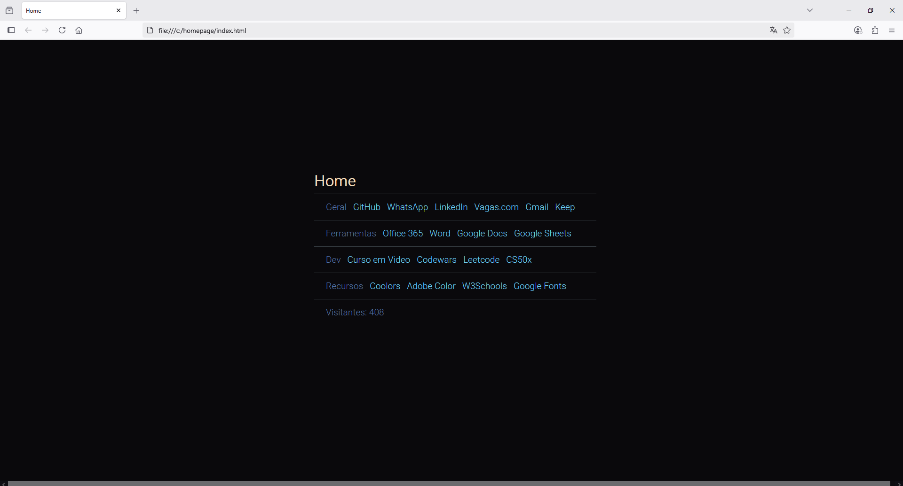

# Startpage

Iniciei esse projeto em Janeiro de 2025, e venho usado ele no meu dia-a-dia desde então. Sempre que eu abro uma nova janela no meu navegador, é esse arquivo que é carregado ao invés da startpage padrão dele.

Inicialmente ele não tinha esse contador de visitantes. Eu tinha curiosidade de ver quantas vezes tinha acessado ele, e também queria treinar um pouco meu JavaScript, aí resolvi adicionar ele em uma segunda versão.

Eu queria um tema escuro, que não agredisse os olhos. Para criar a paleta de cores usei o site [coolors](https://coolors.co/6ccff6-2d3047-e0ca3c-a799b7) (gratuito). 

Tive a ideia para esse projeto em um fórum onde vários usuários postavam cada um a startpage que tinham criado. Acabei que só mostrei essa aqui para um grupo de amigos.

Hoje (07/08/2025), sentei para resolver um pequeno erro que tava me incomodando o suficiente para não publicar o site por aqui. Uma das horizontal rules que separam as sessões do site estava desalinhada das outras. Foi coisa simples.

Estou querendo também adicionar uma previsão do tempo pra minha cidade lá embaixo, antes do contador visitantes, já fiz isso usando uma API em um site separado, falta juntar tudo e ajustar o design.

## Preview da Startpage:

